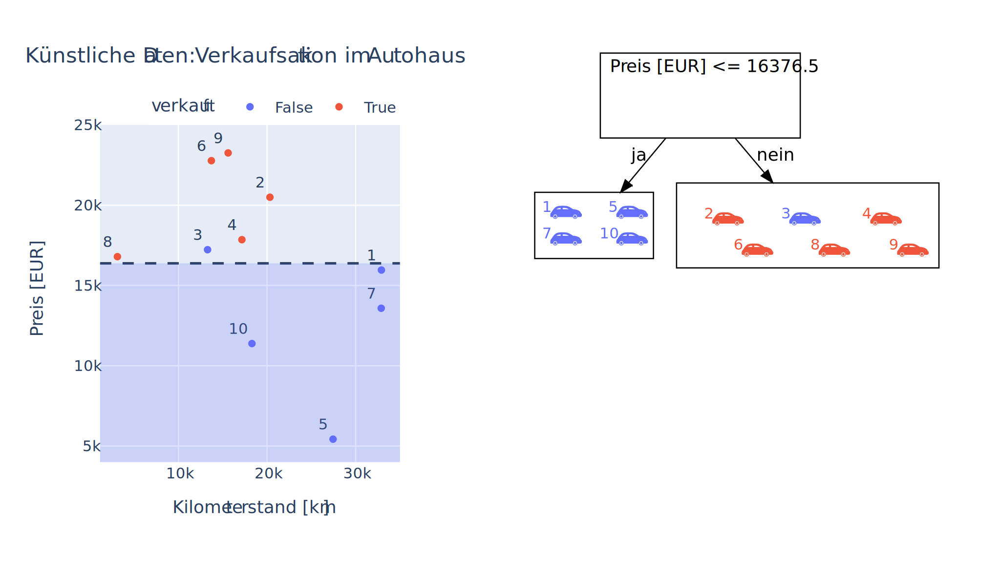
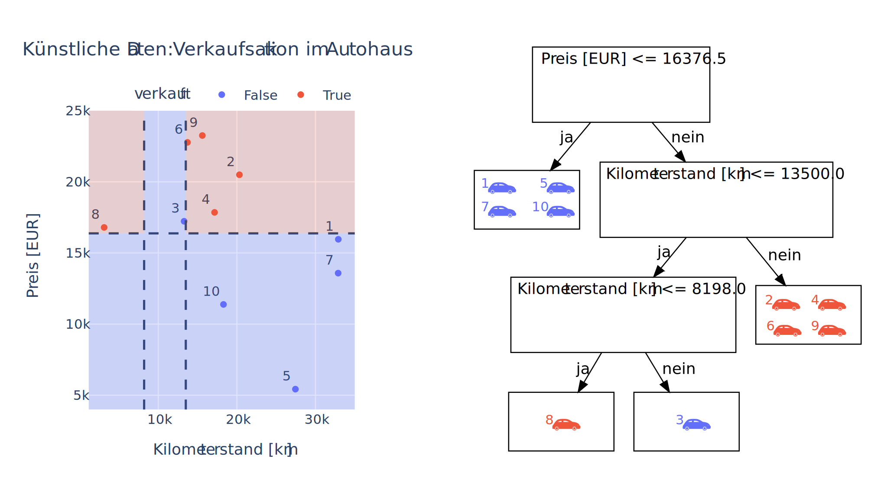

---
jupytext:
  formats: ipynb,md:myst
  text_representation:
    extension: .md
    format_name: myst
    format_version: 1.3
    jupytext_version: 1.14.5
kernelspec:
  display_name: python39
  language: python
  name: python3
---

# 11.1 Entscheidungsbäume (Decision Trees)

Ein beliebtes Partyspiel ist das Spiel "Wer bin ich?". Die Spielregel sind
simpel. Eine Person wählt eine berühmte Person oder eine Figur aus einem Film
oder Buch, die die Mitspieler:innen erraten müssen. Die Mitspieler:innen
dürfen jedoch nur Fragen stellen, die mit "Ja" oder "Nein" beantwortet werden. 

Hier ist ein Beispiel, wie eine typische Runde von "Wer bin ich?" ablaufen
könnte:

* Spieler 1: Bin ich männlich?
* Spieler 2: Ja.
* Spieler 3: Bist du ein Schauspieler?
* Spieler 1: Nein.
* Spieler 4: Bist du ein Musiker?
* Spieler 1: Ja.
* Spieler 5: Bist du Michael Jackson?
* Spieler 1: Ja! Richtig!

Als nächstes wäre jetzt Spieler 5 an der Reihe, sich eine Person oder Figur
auszuwählen, die die anderen Spieler erraten sollen. Vielleicht kennen Sie auch
die umgekehrte Variante. Der Name der zu ratenden Person/Figur wird der Person
mit einem Zettel auf die Stirn geklebt. Und nun muss die Person raten, während
die Mitspieler:innen mit Ja/Nein antworten.

Dieser Partyklassiker lässt sich auch auf das maschinelle Lernen übertragen. 


## Lernziele

```{admonition} Lernziele
:class: admonition-goals
* Sie wissen, was ein **Entscheidungsbaum** ist und kennen die zugehörigen
  Fachbegriffe **Node**, **Branch** und **Leaf**.
* Sie können selbst bei einem kleinen Datensatz einen Entscheidungsbaum
  erstellen.
* Sie können mit Scikit-Learn einen Entscheidungsbaum trainieren lassen.
* Sie können die visuelle Darstellung eines Entscheidungsbaums interpretieren
  und eine Prognose treffen.
* Sie wissen, dass der Entscheidungsbaum zu Overfitting neigt und können seine
  Hyperparameter (z.B. die Baumtiefe) feinjustieren. 
```


## Ein Entscheidungsbaum im Autohaus

Ein **Entscheidungsbaum** gehört zu den überwachten Lernverfahren. Es ist auch
üblich, die englische Bezeichnung **Decision Tree** anstatt des deutschen
Begriffes zu nutzen. Ein großer Vorteil von Entscheidungsbäumen ist ihre
Flexibilität, denn sie können sowohl für Klassifikations- als auch
Regressionsaufgaben eingesetzt werden. Im Folgenden betrachten wir als Beispiel
eine Klassifikationsaufgabe. In einem Autohaus vereinbaren zehn Personen eine
Probefahrt. In der folgenden Tabelle ist notiert, welchen 

* `Kilometerstand [in km]` und
* `Preis [in EUR]`

das jeweilige Auto hat. In der dritten Spalte `verkauft` ist vermerkt, ob das
Auto nach der Probefahrt verkauft wurde (`True`) oder nicht (`False`). Diese
Information ist die Zielgröße. Die Tabelle mit den Daten lässt sich effizient
mit einem Pandas-DataFrame organisieren:

```{code-cell} ipython3
import pandas as pd 

daten = pd.DataFrame({
    'Kilometerstand [km]': [32908, 20328, 13285, 17162, 27449, 13715, 32889,  3111, 15607, 18295],
    'Preis [EUR]': [15960, 20495, 17227, 17851, 5428, 22772, 13581, 16793, 23253, 11382],
    'verkauft': [False, True, False, True, False, True, False, True, True, False],
    },
    index=['Auto 1', 'Auto 2', 'Auto 3', 'Auto 4', 'Auto 5', 'Auto 6', 'Auto 7', 'Auto 8', 'Auto 9', 'Auto 10'])
daten.head(10)
```

Da in unserem Beispiel von den Autos nur die beiden Eigenschaften
`Kilometerstand [km]` und `Preis [EUR]` erfasst wurden, können wir die
Datenpunkte anschaulich in einem zweidimensionalen Streudiagramm (Scatterplot)
visualisieren. Dabei wird der Kilometerstand auf der x-Achse und der Preis auf
der y-Achse abgetragen. Die Zielgröße `verkauft` kennzeichnen wir durch die
Farbe. Dabei steht die Farbe Rot für »verkauft« (True) und Blau für »nicht
verkauft« (False). 

```{code-cell} ipython3
import plotly.express as px

fig = px.scatter(daten, x = 'Kilometerstand [km]', y = 'Preis [EUR]', 
                 color='verkauft', title='Künstliche Daten: Verkaufsaktion im Autohaus')
fig.show()
```

Als nächstes zeigen wir, wie die Autos anhand von Fragen in die beiden Klassen
»verkauft« und »nicht verkauft« sortiert werden können. Links im Streudiagramm
visualisieren wir die Autos mit ihren Eigenschaften `Kilometerstand [km]` und
`Preis [EUR]` als Punkte. Auf der rechten Seite werden wir schrittweise den
Entscheidungsbaum entwickeln. Ein Entscheidungsbaum visualisiert
Entscheidungsregeln in Form einer Baumstruktur. Zu Beginn wurde noch keine Frage
gestellt und alle Autos befinden sich gemeinsam in einem **Knoten** des
Entscheidungsbaumes, der visuell durch einen rechteckigen Kasten symbolisiert
wird. Dieser erste Knoten wird als **Wurzelknoten** bezeichnet, da er die Wurzel
des Entscheidungsbaumes darstellt. 


Dann wird eine erste Frage gestellt. Ist der Verkaufspreis kleiner oder gleich
16376.50 EUR? Entsprechend dieser Entscheidung werden die Autos in zwei Gruppen
aufgeteilt. Wenn ja, wandern die Autos nach links und ansonsten nach rechts. Im
Entscheidungsbaum wird diese Aufteilung durch einen **Zweig** nach links und
einen Zweig nach rechts symbolisiert. Ein alternativer Name für Zweig ist
**Kante**. Die Autos »rutschen« die Zweige/Kanten entlang und landen in zwei
separaten Knoten. Im Streudiagramm entspricht diese Fragestellung dem Vergleich
mit einer horizontalen Linie bei y = 16376.5. Die gesamte Fläche unterhalb
dieser Linie wird blau markiert.



Bei den Autos mit einem Preis kleiner oder gleich 16376.50 EUR müssen wir nicht
weiter sortieren bzw. weitere Fragen stellen. Da aus diesem Knoten keine Zweige
mehr wachsen, wird dieser Knoten auch **Blatt** genannt. Aber in dem Knoten des
rechten Zweiges befinden sich fünf rote (also verkaufte) Autos und ein blaues
(also nicht verkauftes) Auto. Wir wollen diese Autos durch weitere Fragen
sortieren. Doch obwohl nur ein Auto (nämlich Auto 3) aus dieser Gruppe separiert
werden soll, ist dies nicht durch nur eine einzige Frage möglich. Lautet die
Frage: »Ist der Preis kleiner oder gleich 17300 EUR?«, dann wandern das rote
Auto 8 und das blaue Auto 3 nach links. Wählen wir die Frage: »Ist der
Kilometerstand kleiner oder gleich 13500 km?«, dann wandern ebenfalls Auto 3 und
Auto 8 nach links. Beide Fragen sind also gleichwertig, welches sollen wir
nehmen? Wir gehen nach der Reihenfolge der Eigenschaften vor. Da der
Kilometerstand in der Tabelle in der ersten Spalte steht und der Preis in der
zweiten Spalte, entscheiden wir uns für die Frage nach dem Kilometerstand.
  


Jetzt sind aber nur noch zwei Autos im linken Knoten, so dass diesmal eine
weitere Frage ausreicht, die beiden Autos in zwei Klassen zu sortieren. Wir
fragen: »Ist der Kilometerstand kleiner oder gleich 8198 km?«
   


Alle Autos sind nun durch die Fragen sortiert und befinden sich in Blättern.

```{admonition} Was ist ... ein Entscheidungsbaum?
Ein Entscheidungsbaum (Decision Tree) ist ein Modell zur Entscheidungsfindung,
das Daten mit Hilfe einer Baumstruktur sortiert. Die Datenobjekte starten beim
Wurzelknoten und werden dann über Knoten (=Entscheidungen) und Zweige/Kanten (=
Ergebnis der Entscheidung) in Blätter sortiert.
```


## Entscheidungsbaum mit Scikit-Learn

Scikit-Learn bietet einen Algorithmus an, um einen Entscheidungsbaum zu
erstellen. Wir bleiben bei unserem fiktiven Autohaus. Allerdings müssen wir nun
die Klassenbezeichnungen wie beispielsweise 'neu' oder 'gebraucht' als Zahlen
kodieren. Danach extrahieren wir die drei Inputs als Matrix $X$ und unseren
Output als $y$.

```{code-cell} ipython3
# wandle Kategorien in Zahlen um
#data.replace('neu', 1, inplace=True)
#data.replace('gebraucht', 0, inplace=True)

#data.replace('Audi', 0, inplace=True)
#data.replace('BMW', 1, inplace=True)
#data.replace('Citroën', 2, inplace=True)

#data.replace('ja', 1, inplace=True)
#data.replace('nein', 0, inplace=True)

# extrahiere X und y
#X = data.loc[:, 'Zustand':'Preis']
#y = data['Kaufentscheidung']

```

```{code-cell} ipython3
#data.head(12)
```

Nun lassen wir Scikit-Learn einen Entscheidungsbaum erstellen. Dazu importieren
wir `DecisionTreeClassifier` aus dem Untermodul `sklearn.tree`. Danach
trainieren wir den Entscheidungsbaum mit `.fit()`.

```{code-cell} ipython3
#from sklearn.tree import DecisionTreeClassifier

#model = DecisionTreeClassifier()
#model.fit(X,y);
```

Aber wie sieht denn jetzt der Entscheidungsbaum aus? Das Scikit-Learn-Modul
`sklearn.tree` stellt auch eine Funktion namens `plot_tree` zur Verfügung, die
Entscheidungsbäume zeichnen kann. Wir importieren sie direkt und wenden Sie an.

```{code-cell} ipython3
#from sklearn.tree import plot_tree 

#plot_tree(model);
```

In den Kästchen, die den Wurzelknoten und die inneren Knoten darstellen, steht
jeweils in der ersten Zeile, welches Feature überprüft wird und wie die
dazugehörige Frage lautet. Bei unserem Wurzelknoten also `X[1] <= 0.5`. Das
bedeutet, das als erstes das 2. Feature, also die Marke benutzt wird. Die Marken
waren als Audi = 1, BMW = 2 und Citroën = 3 kodiert. Somit bedeutet diese
Entscheidung, dass Audis nach links und BMW/Citroën nach rechts gesteckt werden.
Damit ist der linke Ast schon beendet, alle Audis wurden nach der Probefahrt
gekauft.

Damit sich der Entscheidungsbaum leichter lesen lässt, können wir die Namen der
Features anstatt `X[0]`, `X[1]`und `X[2]` verwenden. Dazu setzen wir die Option
`feature_names=['Zustand','Marke','Preis']`.

```{code-cell} ipython3
#plot_tree(model,feature_names=['Zustand','Marke','Preis']);
```

Der Eintrag `samples` in den Knoten verrät, wie viele Datensätze in den linken
Zweig wandern und wie viele nach rechts. Die drei Audis kommen nach links
(`samples = 3`) und die neun BMW/Citroëns (`samples = 9`) kommen nach rechts. 

Der linke Endknoten enthält nun drei Audis. Von diesen drei Audis werden am Ende
0 nicht gekauft und 3 gekauft. Das wird in der letzten Zeile beschrieben: `value
= [0, 3]`. Daher müssen keine weiteren Fragen gestellt werden. 

Die neun BMW/Citroëns enthalten aber noch Fahrzeuge mit beiden
Kaufentscheidungen. Der value wird mit `[6,3]` angegeben. Also befinden sich
noch 6 nicht gekaufte Fahrzeuge und 3 gekaufte Fahrzeuge in diesem Zweig. Wir
müssen weitere Fragen an die Features stellen, um diese Fahrzeuge korrekt zu
klassifizieren.

Daher wird nun nach dem Zustand des Fahrzeugs gefragt. `Zustand <= 0.5` meint
die Gebrauchtwagen, da wird die Klassenbezeichnung 'gebraucht' durch eine Null
ersetzt haben und 'neu' durch eine Eins. Links führt wieder zu einem Endknoten,
rechts zu einem gemischten Knoten. Es wäre schön, schneller erkennen zu können,
ob ein Knoten nur noch Autos mit einer Kaufentscheidung enthält, also ein reiner
Endknoten ist, oder ob der Knoten noch gemischt ist und somit ein innerer
Knoten. Dazu gibt es eine weitere Option, mit der wir die Kästchen farblich
füllen können. Sie lautet simpel: `filled=True`. 

Je dunkler die Farbe, desto reiner der Knoten!

```{code-cell} ipython3
#plot_tree(model,feature_names=['Zustand','Marke','Preis'], filled=True);
```

Wenn wir uns die vier Endknoten, also die Blätter betrachten, so haben wir von
links nach rechts 3 Autos, die gekauft wurden (`[0,3]`), 5 Autos, die nicht
gekauft wurden (`[5,0]`), wiederum 3 Autos, die gekauft wurden (`[0,3]`) und
zuletzt 1 Auto, das nicht gekauft wurde (`[1,0]`).

+++

## Komplexität von Entscheidungsbäumen

Entscheidungsbäume tendieren schnell zum Overfitting. Natürlich können wir
solange weiter Fragen stellen, bis jedes Leaf/Endknoten nur noch Datenpunkte
einer Klasse enthält. Damit hätten wir also eine 100-prozentige Prognose auf den
Trainingsdaten. Wie so oft bedeutet dies aber nicht, dass der so trainierte
Entscheidungsbaum gut verallgemeinerbar ist.

Um das Overfitting zu vermeiden, werden vor allem zwei Methoden verwendet:
**Prä-Tuning** und **Post-Tuning**.

1. Prä-Pruning: die maximale Tiefe des Baumes wird begrenzt oder es wird eine
   bestimmte Mindestanzahl von Datenpunkten pro Knoten gefordert
2. Post-Pruning: im Nachhinein werden Knoten mit wenig Informationen aus dem
   Entscheidungsbaum entfernt oder Knoten werden zusammengelegt

Scikit-Learn hat nur Prä-Pruning implementiert. Beispielsweise können wir mit
dem Argument `max_depth=2` die Tiefe unseres Entscheidungsbaumes auf 2
begrenzen.

```{code-cell} ipython3
#model_begrenzt = DecisionTreeClassifier(max_depth=2)
#model_begrenzt.fit(X,y);

#plot_tree(model_begrenzt,feature_names=['Zustand','Marke','Preis'], filled=True);
```

Dadurch sind die Blätter/Endknoten aber nicht mehr rein. 

Weitere Möglichkeiten des Prä-Pruning finden Sie in der [Dokumumentation
Scikit-Learn →
DecisionTreeClassifier](https://scikit-learn.org/stable/modules/generated/sklearn.tree.DecisionTreeClassifier.html).
